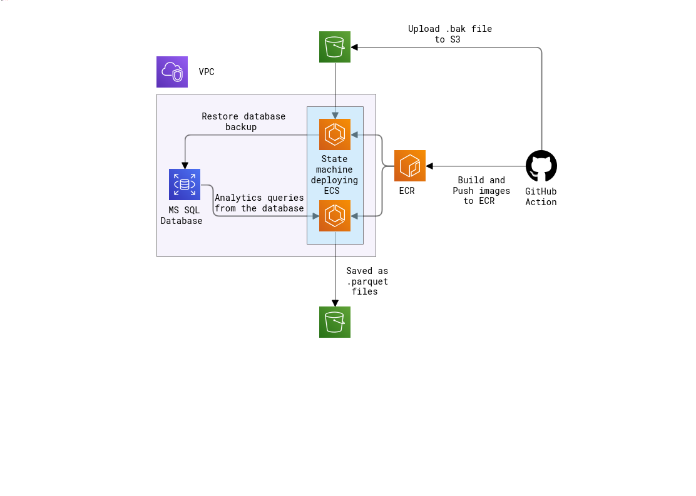

# Basic cloud data pipeline using Terraform

## Author

Arnold LAURENT student @ [Turing College](https://www.turingcollege.com/)

## Introduction

The goal of this project is to create an AWS infrastructure using Terraform and deploy it automatically using GitHub Action.

### Technologies used in this project :

* Terraform
* GitHub Action
* Python
* Bash
* AWS (S3, RDS, ECS)
* Docker

## Infrastructure diagram



On push, GitHub action will trigger in the following order :

1) Create the ECR repos that will contains the images of the scripts restoring the database and creating analytics reports.

2) Build and push those images to the ECR.

3) Download the AdventureWork .bak file.

4) Deploy the rest of the infrastructure.

5) Start the state machine deploying the ECS to run the scripts.

## How to use

If you wish to try to deploy it yourself, you can simply clone this repo and push it to GitHub.

Here are the steps to follow to configure it :

1) Make sure you have your [AWS secret key](https://docs.aws.amazon.com/cli/v1/userguide/cli-configure-files.html) set up correctly.

2) Create a new bucket that will hold your .tfstate file and modify this line in [main.tf](./terraform_config/main.tf) 

````
backend "s3" {
    bucket = "your-tfstate-bucket"
    key    = "terraform.tfstate"
    region = "your-region"
  }
````

3) Optionnaly you can also change the variables inside variables.tf if you wish to change the deployement plan.


