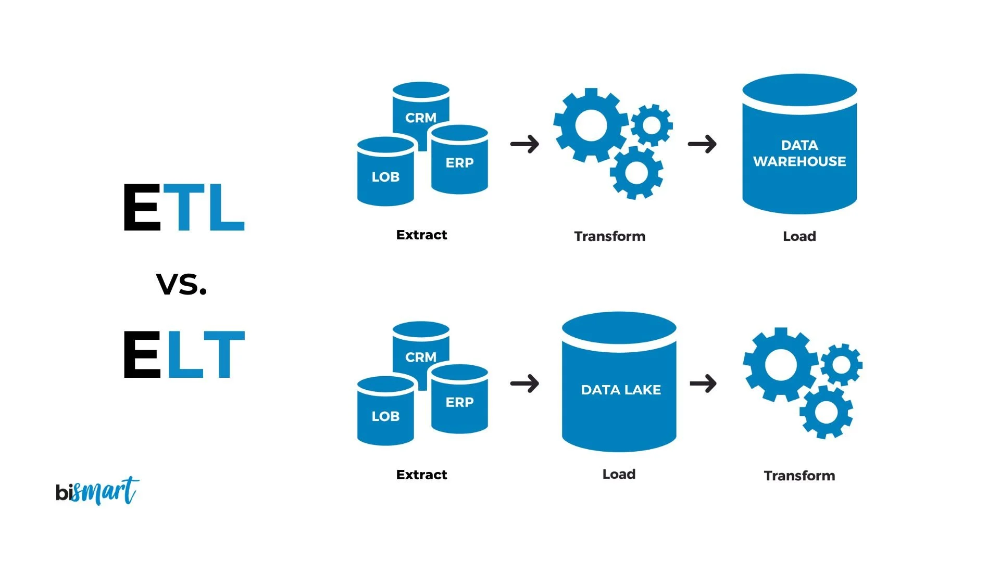

# E to T: Your Complete Guide to Modern Data Pipelines

This article can also be read on my [Substack](https://laurentarnold.substack.com/p/e-to-t-your-complete-guide-to-modern)

## 1. Introduction

Constructing a reliable data pipeline can be a complex challenge, leaving many data engineers with unanswered questions. What tools are required? How can we ensure each step of the ELT (Extract, Load, Transform) process is executed flawlessly? And importantly, how do we build pipelines that are scalable and maintainable for the long-term?

In this article, we'll tackle these common questions head-on. We'll walk through the process of designing and building a data pipeline, from start to finish. The goal of this article is for you to gain knowledges and understandings of how data pipelines work through practical example.

Our example will involve extracting data from a public API, loading it into a database, and then transforming the raw data into valuable analytics. Along the way, we'll introduce you to the standard tools and concepts that data engineers rely on daily.

### What are data pipelines and the ELT process ?

First we need to understand what exactly are data pipelines.

A **Data Pipeline** is a series of interconnected steps that automate the movement and transformation of data from one system to another.

The **ELT process** are the steps the data takes inside the data pipeline, it's first Extracted from a source system, then Loaded into a database and lastly Transformed into data ready for analysis.

This differs from the traditional ETL (Extract, Transform, Load) process, which transforms the data before loading it into the database.



### What you will learn by the end and the tools we will be using

* How to extract data from an API and loading it into a database using a **Python** script.

* Containerizing your project using **Docker** to improve accessibility.

* Transforming your data with **dbt**.

* Orchestrating the flow of the pipeline with **Airflow**.

### The football data pipeline we will be building

For this article, I've chosen to use football results as an example of how to build data pipelines. 

Specifically, I wish to ingest the latest results from the top European leagues into a database every week after the matches are played.

We will use [this](https://www.football-data.org/) API that can provide the latest football results for free.

## 2. Setting Up the Development Environment

Usually, when building data pipelines, we want them to run on a certain schedule (every day, every week, ...). To do that, it's wise to put our application inside a remote server that will be able to execute the code anytime. And the best way to deploy code to servers without worrying about the environment is with [Docker](https://www.docker.com/).

### Docker Basics

In Docker, **containers** are small packages containing everything needed to run an application that will be deployed in a server. From a minimal OS and additional libraries to the code of the app itself.

Containers are created from **Images** - cached files that tell the Docker engine how to run the container. Images can be configured using a **Dockerfile** where we write exactly how we want the container to behave. More on this later.

Those are simplified explainations, more info can be found [here](https://docs.docker.com/get-started/docker-concepts/the-basics/what-is-an-image/).


### Orchestrating Everything with Airflow

In our case, we won't build an image from scratch to run our ELT scripts. Instead, we will use Airflow to help us schedule and verify that every step of the process is completed correctly.

[Airflow](https://airflow.apache.org/) is an orchestration tool written in Python that lets us define series of tasks that will be executed one after another.

#### What is a DAG ?

DAG, or Directed Acyclic Graph, is the primary component of Airflow. It lets us define tasks and conditions needed to run those tasks.


In our case, our DAG will look something like this:

1) Download the data from the API

2) Upload the data to the database

3) Transform the data

We won't do any branching as we need each task to be executed correctly before proceeding to the next one.

#### Launching Airflow with Docker

Airflow is a complex tool that needs multiple containers running together to work correctly. 

To launch and administer multiple containers at the same time, Docker provides a tool named docker-compose that lets us provide Docker with a .yml config file containing the configuration of all the containers we want to start simultaneously.

Airflow can provide us a default docker-compose.yml file [here](https://airflow.apache.org/docs/apache-airflow/2.10.3/docker-compose.yaml).

At first glance, it looks very complex, but we won't need to change much of it to get our data pipeline running. In this article, I'll highlight the changes to the file that I'll make.

If we were to launch the docker-compose tool now, Airflow would start correctly; we just don't have any DAGs defined yet.

## 3. Extracting the data

The first step we need to achieve is to actually find and download the results of the football games played during the week. 

So now, we will start defining our DAG and writing the first few functions that will connect to the API and download the dataset.

### First part of our DAG

The DAG definition is quite simple. We import the DAG class from Airflow and instantiate a new DAG object.

````
from airflow.models.dag import DAG

dag = DAG(
    dag_id="download_football_data",
    schedule_interval="0 0 * * 1",
    start_date=datetime.datetime(2024, 8, 10), #Start of the earliest competition
    catchup=True
)
````

**dag_id** is the name of our DAG that will be shown in the Airflow UI.

**schedule_interval** is a [cron](https://www.baeldung.com/cron-expressions#cron-expression) expression that will run the DAG every Monday.

**start_date** is the date we want to start our DAG, which will be August 18th, the start of the Premier League season.

**catchup=True** means that we want our DAG to run backwards from our start date, every week until the current date. I put this option to get the full data of the leagues from the API.

### The python script to extract the data

I won't go into too much detail on how the script to download the data works. If you're curious, you can check [get_data.py](./src/get_data.py).

Essentially, what it does is:

* Calculate the start and end date of the week based on the execution date.
* Takes a list of competitions and connects to the API, fetching the results for the last week.
* Writes a temporary JSON file with the result of the API call.

After that, we can create a task that will start our function when the DAG is activated:

````
from airflow.operators.python import PythonOperator

competitions = ['PL', 'CL', 'BL1', 'SA', 'PD']

fetch_data = PythonOperator(
    task_id="fetch_data",
    python_callable=get_data.fetch_all_competitions,
    op_kwargs={"competitions": competitions, 
               "execution_date": "{{ds}}"},
    dag=dag
)
````

**task_id** is the name of the task.

**python_callable** is the function we want to run.

**op_kwargs** are the keyword arguments for the function. Competitions is the list of competitions we are interested in, and {{ds}} is a Jinja template that will return the execution date of the DAG.

**dag** is the DAG we want to assign the task to.

## 4. The Loading of the data

Now that we have download the data via the API, it's time to make it permanent and put it inside a PostgresDB.

Because Airflow is designed to scale easily by adding multiple containers, it's not designed to share information between tasks. This is the reason why I chose to write the JSON files with the data in the previous part of the project. 

### Moving the data to the database

Once again I won't go into the full description of the function but here is how it works :

* The functions loops through the temp folder where the JSON files are stored.

* Each JSON file are place inside a Pandas dataframe.

* The pandes dataframe are merged into one.

* The *to_sql()* method is used to upload the merged dataframe to the database.

Now we have to create the Airflow task and associate it to the dag.

````
upload_data = PythonOperator(
    task_id="upload_data",
    python_callable=insert_data.upload_data,
    op_kwargs={"db_url": os.getenv('DBURL')},
    dag=dag
)

remove_data = PythonOperator(
    task_id="remove_data",
    python_callable=insert_data.remove_data,
    dag=dag
)
````

I also created a function that will remove the temporary files from the temp folder. This function will be executed after all the files are correctly uploaded.


## 5. Transforming the data

The last part of the ELT process is to transform the data into something ready for analysis. While the data we have is already in a quite good shape, we can improve it with dbt.

### dbt Basics

[dbt](https://www.getdbt.com/) is a Python-based tool that allows us to build SQL models, test those models, and create documentation easily.

Once we have initiated the dbt project, a new folder is created. Inside of it, there are many different folders, but the two things we are interested in are the *models* folder and *dbt_project.yml*.

Inside *dbt_project.yml*, we will define the configurations of the project. The one thing we need to change is the way we want our models to be materialized.

So, on the last line of this file, we will add these lines:

````
models:
  dbt_football:
    mart:
      +materialized: table
````
This will tell dbt to materialize our mart model into a table. If left undefined, the materialization would have been a view.

Next, we create a new folder mart inside the models folder. This is where we will put our SQL files and schema.yml file that we need to define the sources and tests for our model.

To define our source data for this model, we add these lines into the new *schema.yml* file:

````
sources:
  - name: raw
    tables:
      - name: matches_data
````

### Implementing new models

Now that we are done with the config files, we can start building models.

The first one we'll do is clean_data.sql, where I change the data types and make the data more consistent.

````
select  distinct id,
        competition_name,
        utc_date::timestamp,
        matchday::smallint,
        stage,
        home_team_name,
        home_team_tla,
        away_team_name,
        away_team_tla,
        case when winner = 'HOME_TEAM' THEN  home_team_name
                when winner = 'AWAY_TEAM' THEN away_team_name
                else winner end as winner,
        duration,
        home_team_score::smallint,
        away_team_score::smallint

from {{ source('raw', 'matches_data') }}
````
This model will be used as the source for the next ones.

Because of the free tier for the API, we don't have much deep data to work with, such as who scored goals, who assisted, saves made, etc. So, I'll build a league table that will calculate the number of points for each team.

````
with source as (
    select *
    from {{ ref('clean_data') }}
    where competition_name = 'Primera Division'
),

results as (
    select home_team_name as team, 
            winner,
            home_team_score as goals_for,
            away_team_score as goals_against

    from source

    union all

    select away_team_name as team, 
            winner,
            away_team_score as goals_for,
            home_team_score as goals_against
    from source
),

result_table as (

select team,
        count(*) as matches_played,
        COUNT(CASE WHEN team = winner THEN 1 END) AS wins,
        COUNT(CASE WHEN winner = 'DRAW' THEN 1 END) AS draws,
        COUNT(CASE WHEN team != winner AND winner != 'DRAW' THEN 1 END) AS loses,
        SUM(goals_for) as goals_for,
        SUM(goals_against) as goals_against
from results
group by team
)

select *,
        (wins*3) + (draws*1) as points,
        goals_for - goals_against as goal_differences
from result_table
order by points desc, goal_differences desc
````
The **results** CTE duplicates the result of each match for the home and away team, then unions the tables. This will help us calculate the number of wins, losses, and draws with a simple group by in the next CTE.

The last part makes simple calculations for the number of points and the goal differences.

Resulting in this table:


Now to actually run our model, we need to setup a [profiles.yml](https://docs.getdbt.com/docs/core/connect-data-platform/profiles.yml) file that will tell dbt what database to connect to.

Ours will look like this :

````
dbt_football:
  outputs:
    dev:
      dbname: football_data
      host: postgres
      pass: airflow
      port: 5432
      schema: raw
      threads: 1
      type: postgres
      user: airflow
  target: dev
````
### Running dbt with Airflow

Before being able to run dbt in our DAG, we need to put the dbt folder inside the Airflow containers so that the Python script can access it.

To achieve that, we need to modify the Airflow Docker image...

We create a new Dockerfile with those lines:

````
FROM apache/airflow:2.10.0

COPY ./dbt_football /opt/airflow/dbt_football

COPY ./profiles.yml /.dbt/profiles.yml

````
*It's not the full Dockerfile but just the line needed for dbt*

The FROM line is mandatory so Docker knows what the base image is.

The two COPY lines will copy the dbt folder and profiles.yml into their respective folders inside the container when run.

Now, we also need to modify the docker-compose.yml file:

````
 #image: ${AIRFLOW_IMAGE_NAME:-apache/airflow:2.10.0}
  build: .
````
On line 52, we need to comment out the image line and uncomment the build: . line. This will tell Docker to rebuild the image from our Dockerfile instead of pulling it from the Airflow repo.

Now, we can add our last task to the DAG. To do so, we will not use a Python function but the Bash operator, which will allow us to run Bash commands with specific arguments.

````
run_dbt = BashOperator(
    task_id="run_dbt",
    bash_command="dbt build --project-dir /opt/airflow/dbt_football --profiles-dir /.dbt",
    dag=dag
)
````
We tell Airflow to run the command dbt build and give it the location of the dbt folder and the folder where our profile.yml file is stored.

Lastly, we add this line at the end of our airflow_dag.py to define the order in which the tasks need to be executed:

````
fetch_data >> upload_data >> remove_data >> run_dbt
````

## 6. Conclusion

Now our DAG is finished, ready to be executed every Monday to fetch the latest football results.

If we connect to the Airflow web UI, we can see our final DAG graph:


Once the DAG is triggered, the four tasks will be executed in succession, only if the previous one finished successfully.

### Improvements for this project

As it stands, just having the match results and league tables inside our database is not very useful - it would be faster to Google this information.

This project is more of a proof of concept rather than a fully-fledged project ready for production, but here are some ideas on how to improve it to make it more useful:

* Have a task send an email every week with the results of the best matches based on certain criteria (For example, the matches with the most goals scored)

* Find another API to improve the data that we have. It would be better if we had stats like who scored the goals, number of saves, yellow and red cards inside our database.

* Improve scalability and make it easier to add competitions. Currently, new competitions can only be added directly through the source code. We might want to change that and let users define their desired competitions through a UI.

### Final words

I hope you enjoyed this article and gained some insights on how a data pipeline works behind the scenes.

I chose not to go into too many details for each of the tools presented but rather show their functionality and how they relate to the ELT process. You are now equipped with the basics of each of these tools and ready to dig deeper into them if you wish to build your own data pipelines.