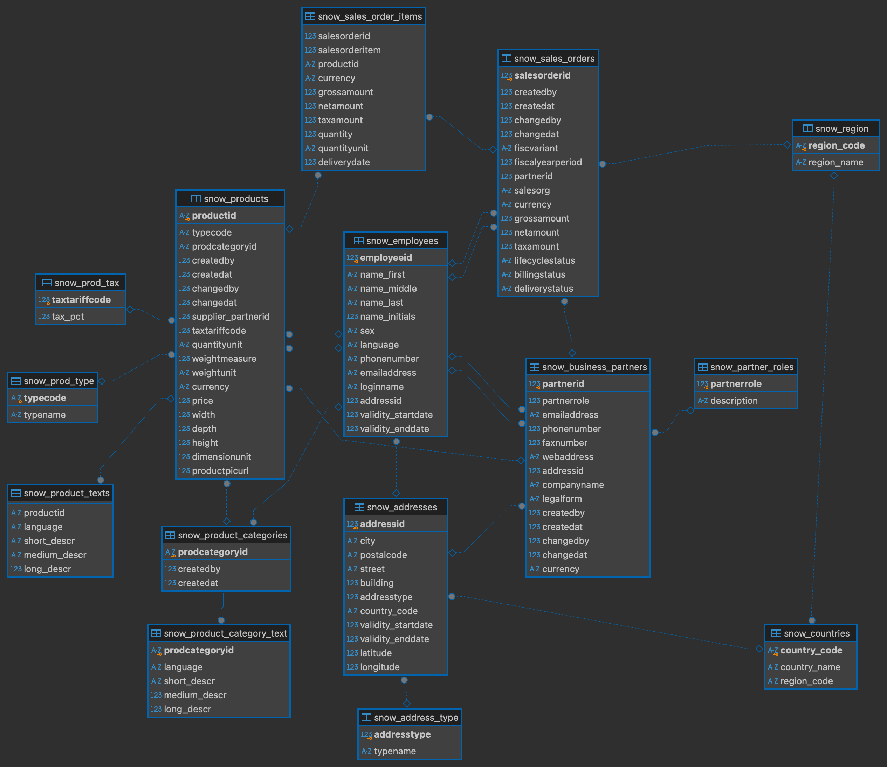

# Data Modeling Deep Dive: Snowflake Schema, Star Schema, and One Big Table Approaches

## Introduction

Ever wondered how data engineers turn a mess of information into a streamlined, efficient database? 

Enter the world of data modeling. But what exactly is it? And why does it matter in the age of big data? From snowflake schemas to the controversial 'One Big Table' approach, data modeling techniques can make or break your database performance. 

In this deep dive, we'll unravel the mysteries of data modeling, explore best practices, and guide you through the most common approaches. 

### What is data modeling ?

In the world of data engineering, few concepts are as fundamental – and as crucial – as data modeling. But what exactly is it?

Wikipedia offers us this formal definition:

"*Data modeling is a process used to define and analyze data requirements needed to support the business processes within the scope of corresponding information systems in organizations.*"

While technically accurate, this definition might leave some readers scratching their heads. Let's break it down into something more digestible:

At its core, data modeling is the process of creating a visual representation of how data is organized and related within a database system. It's like creating a blueprint for your data, helping you design efficient and effective ways to store, access, and manage information.

Think of it as architecting a city for your data. Just as urban planners decide where to place buildings, roads, and utilities for optimal city function, data modelers determine how different pieces of data should be structured and connected for optimal database performance.

### Understanding data modeling, key concepts

Before going deeper into the different models possible for a database, we need to understand a few key concepts.

* **Normalization** : Data normalization is the process of organizing data in a database to reduce redundancy, improve data integrity, and eliminate data anomalies. It involves breaking down large tables into smaller, more focused tables and establishing relationships (like primaries and foreigns keys) between them.

* **Denormalization** : Data denormalization is the reverse of the normalization. It implies joining tables together and duplicates some of the data. The goal of the denormalization is to reduce the number of table and make the database schema more accessible.

* **Fact table** : A fact table is the primary table in a data warehouse that stores measurable, quantitative data about business operations.

* **Dimension table** : A dimension table contains descriptive information that gives context to the numeric data in fact tables.

### The example database

For this article, I'll use [this](https://www.kaggle.com/datasets/yasinnaal/bikes-sales-sample-data) example database from Kaggle. Using dbt, I have added a few example tables to really make the database more concrete.
The data set by default also doesn't contains any primary or foreign key constraints so I have added those using dbt.

As this data is already quite normalized it'll be a good to starting for our first data model : The snowflake schema...

## The snowflake schema

The snowflake schema is a highly normalized data model.

It is composed of facts and dimension table. Each of the dimension table can also have dimension tables to explain some columns of the previous dimension table.


In our example database, there is already a snowflake schema in place :



To really understand the snowflake schema, let's have a closer look at the *products* table :


In this example we can see the fact table *sales_order_items* has the *product* table dimension and the *product* table has multiple smaller dimension tables.


### Pros and Cons of the snowflake schema

**Pros** :

* The highly denormalized nature of the snowflake schema allows maximum memory efficiency, the database will take the minimum storage space possible.

* The data is easier to maintain. When there are changes in a dimension table, it only need to be changed in one place.


**Cons** :

* A big snowflake schema can get confusing quickly. When the numbers of facts and dimension table get high, it's difficult to understand what's going on inside the database.

* The snowflake schema sometimes require data analysts to perform complex joins to access the data they need for their analysis.

* Query efficiency is not as good as more denormalized approach due to the high number of joins need to access the data. 

## The star schema

The star schema is a denormalized version of the snowflake schema. 

It's also composed of facts and dimensions but while fact table can have multiple dimensions, those dimensions can't have dimensions table of their own.


To change our database from a snowflake schema into a star schema, we'll have to join the smaller dimensions to their main dimension.

For example to update the product dimension into the star schema, we can join all of the smaller dimensions like this :

````
select p.productid,
        p.typecode,
        type.typename,
        p.createdby,
        p.createdat,
        p.changedby,
        p.changedat,
        p.supplier_partnerid,
        t.taxtariffcode,
        t.tax_pct,
        p.quantityunit,
        p.weightmeasure,
        p.weightunit,
        p.currency,
        p.price,
        p.width,
        p.depth,
        p.height,
        p.dimensionunit,
        p.productpicurl,
        text.language,
        text.short_descr,
        text.medium_descr,
        text.long_descr,
        p.prodcategoryid,
        pct.language as cat_language,
        pct.short_descr as cat_short_descr,
        pct.medium_descr as cat_medium_descr,
        pct.long_descr as cat_long_descr

from "bike_sale"."target_snowflake"."snow_products" p
left join "bike_sale"."target_snowflake"."snow_prod_tax" t 
    on p.taxtariffcode = t.taxtariffcode
left join "bike_sale"."target_snowflake"."snow_prod_type" type 
    on p.typecode = type.typecode
left join "bike_sale"."target_snowflake"."snow_product_texts" as text 
    on p.productid = text.productid
left join "bike_sale"."target_snowflake"."snow_product_categories" as pc 
    on p.prodcategoryid = pc.prodcategoryid
left join "bike_sale"."target_snowflake"."snow_product_category_text" as pct 
    on pc.prodcategoryid = pct.prodcategoryid

````
*Note: I use dbt for this project so I can just use select statements and dbt will handle the ddl and create the new table for me*

After denormalizing the others tables the same way, we are left with this schema :


### Pros and Cons of the star schema

**Pros** :

* They are easy to understand. The users can easily understands the relationships between the facts and dimensions tables.

* Better performances. Because the tables are denormalized, they require less join to get the data thus making the queries faster.

**Cons** : 

* Higher costs. Redundant data due to the denormalization process makes the tables larger and thus the cost of storing those tables higher.

* Difficult to maintain. The more time passes and the more the data evolves the more difficult it is to maintain the database because the modified data sometimes need to be changed at multiple places.

## The One Big Table (OBT) approach

As the name suggest, the One Big Table approach denormalize fully our database and put the dimension attributes directly inside the fact table.

For example, to fully denormalize our *product* table, we will join it the business partners table like so :

````
select p.*,
        b.partner_description,
        b.emailaddress,
        b.phonenumber,
        b.faxnumber,
        b.webaddress,
        b.companyname,
        b.legalform,
        b.currency as partner_currency,
        b.city as partner_city,
        b.postalcode,
        b.street,
        b.building,
        b.address_typename,
        b.country_code,
        b.country_name,
        b.region_code,
        b.region_name,
        b.validity_startdate,
        b.validity_enddate,
        b.latitude,
        b.longitude
from "bike_sale"."target_star"."star_products" p
left join "bike_sale"."target_star"."star_business_partners" b 
    on p.supplier_partnerid = b.partnerid
````

After that we will also denormalize the *sales_orders* table and the *employees* table which will leave us with this schema :


### Pros and Cons of the OBT

**Pros** :

* Even better performances. OBT significantly reduces the need for complex joins, resulting in faster query execution times.

* Simplified querying. With all data in a single table, writing and understanding queries becomes more straightforward.

**Cons** :

* Difficult to maintain. If a dimension changes, it need to be updated in every rows. Also if a new data source is added, the table needs to be rebuild.

* Data redundancy. The denormalized structure leads to substantial data duplication, increasing storage requirements and potentially raising costs.


## Conclusion

As we've explored the snowflake schema, star schema, and One Big Table (OBT) approach, it's clear that each data modeling technique has its strengths and ideal use cases. The choice between these schemas depends on various factors including the nature of your data, query patterns, maintenance requirements, and performance needs.

**Snowflake Schema**

Best for: Highly normalized data environments where data integrity and minimal redundancy are top priorities.

Use when:

* You have complex, hierarchical dimensions that benefit from being broken down into multiple tables.
* Storage costs are a significant concern, and you want to minimize data duplication.
* Your data warehouse primarily serves for deep, complex analyses where query performance isn't the top priority.


**Star Schema**

Best for: Balancing performance with a reasonable level of denormalization.

Use when:

* You need faster query performance than a snowflake schema but still want some level of normalization.
* Your dimensions are relatively simple and don't require multiple levels of hierarchy.
* You're building a data warehouse for business intelligence and OLAP (Online Analytical Processing) systems.


**One Big Table (OBT) Approach**

Best for: Scenarios where query performance is the absolute top priority.

Use when:

* You have a relatively small to medium-sized dataset that doesn't change frequently.
* Your queries almost always involve joining multiple dimensions with facts.
* You're working with systems that benefit from denormalized data, like certain NoSQL databases or big data platforms.


Remember, these aren't rigid rules, but guidelines. In practice, many organizations use a combination of these approaches, tailoring their data model to specific use cases within their data ecosystem.

Ultimately, the goal of data modeling is to create a structure that makes your data accessible, understandable, and efficient to work with. Whether you choose a snowflake schema for its normalization, a star schema for its balance, or an OBT for raw speed, the key is to align your choice with your specific business needs and technical environment.

